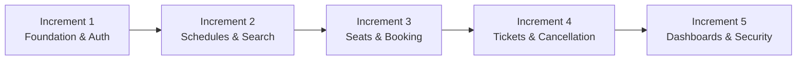
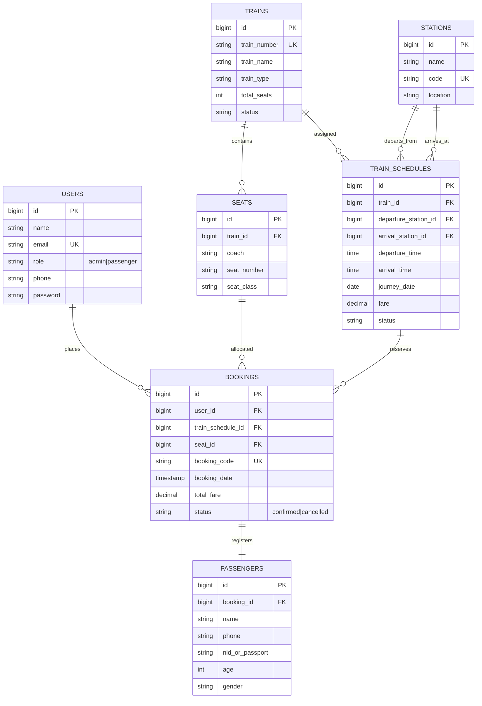

# 🚆 Bangladesh Railway Ticket Booking & Reservation System

[](https://laravel.com)
[](https://php.net)
[](https://adminlte.io)
[](LICENSE)
[](tests)

> **Course:** Software Engineering Laboratory (CSE 3-2)  
> **Project Type:** Web Application & Database Systems  
> **Architecture:** Model-View-Controller (MVC) + Service Layer + Policy Layer  

---

## 📖 Table of Contents

1. [Project Title & Overview](#1-project-title--overview)
2. [Problem Statement](#2-problem-statement)
3. [Project Objectives](#3-project-objectives)
4. [Main Features](#4-main-features)
5. [Technology Stack](#5-technology-stack)
6. [Software Process Model](#6-software-process-model)
7. [Why Incremental Model Was Selected](#7-why-incremental-model-was-selected)
8. [Incremental Development Plan](#8-incremental-development-plan)
9. [System Modules](#9-system-modules)
10. [Database Architecture & Schema](#10-database-architecture--schema)
11. [Laravel Architecture & Design Patterns](#11-laravel-architecture--design-patterns)
12. [Installation Requirements](#12-installation-requirements)
13. [Installation Steps](#13-installation-steps)
14. [Environment Configuration](#14-environment-configuration)
15. [Database Setup & Migrations](#15-database-setup--migrations)
16. [Seeding Demo Data](#16-seeding-demo-data)
17. [How to Run the Project](#17-how-to-run-the-project)
18. [Default Login Credentials](#18-default-login-credentials)
19. [Automated Testing Instructions](#19-automated-testing-instructions)
20. [Security & Concurrency Defenses](#20-security--concurrency-defenses)
21. [Git & GitHub Workflow](#21-git--github-workflow)
22. [Team Contributions](#22-team-contributions)
23. [Screenshots Section](#23-screenshots-section)
24. [License & Acknowledgments](#24-license--acknowledgments)

---

## 1. Project Title & Overview

**Bangladesh Railway Ticket Booking & Reservation System** is an enterprise-grade, web-based railway ticket management and reservation platform designed to streamline train schedules, passenger seat selection, real-time ticket checkout, and administrative fleet operations.

Built with **Laravel** and the **AdminLTE 3.2** dashboard framework, the system bridges the gap between physical ticket counters and modern digital self-service reservation systems, ensuring concurrency-safe booking transactions, role-based authorization, and instant printable E-Ticket generation.

---

## 2. Problem Statement

Traditional railway ticketing suffers from:
* **Overcrowded physical counters** with long queues and manual errors.
* **Double booking risks** when multiple booking clerks or users reserve the same seat simultaneously.
* **Lack of real-time visibility** into available train seats by coach and compartment class.
* **Difficult cancellation workflows** that fail to promptly release seats back to the passenger pool.
* **Fragmented administration**, where timetable scheduling, fleet capacity, and revenue metrics are managed on disparate legacy tools.

---

## 3. Project Objectives

1. **Digital Self-Service**: Enable passengers to search routes, inspect real-time seat availability, reserve tickets, and print official E-Tickets.
2. **Transactional Integrity**: Guarantee that no seat is double-booked using pessimistic locking (`lockForUpdate`) inside database transactions.
3. **Role-Based Access Control (RBAC)**: Enforce strict boundaries between system administrators and passengers using Laravel middleware and policies.
4. **Seamless Cancellation & Seat Re-allocation**: Provide automated ticket cancellation workflows that immediately return freed seats to the booking engine.
5. **Operational Administrative Cockpit**: Deliver an administrative dashboard with live network metrics, schedule management, coach capacity tools, and master booking records.

---

## 4. Main Features

### 👨‍💼 Administrator Capabilities
* **System Metric Cockpit**: 7 live widgets showing total passengers, trains, stations, schedules, total bookings, confirmed trips, and cancellations.
* **Train Schedule Management**: Full CRUD for train routes, departure/arrival station pairings, 24-hour departure/arrival times, journey dates, fares, and operational statuses.
* **Seat Fleet Management**: Single seat additions and bulk coach seat generation (`KA`, `KHA`, `GA`, etc.) across classes (`SNIGDHA`, `SHOVON_CHAIR`, `AC_BERTH`, `FIRST_CLASS`).
* **Master Booking Registry**: Real-time registry with PNR code search, train filters, and status badges.
* **Administrative Ticket Cancellation**: Ability to cancel any booking on behalf of customers.

### 🧑‍🦱 Passenger Capabilities
* **Route & Date Search**: Filter available schedules by origin station, destination station, and journey date.
* **Visual Seat Selection**: Interactive coach seat map with real-time green (available), blue (selected), and red (occupied) visual indicators.
* **Secure Reservation Checkout**: Server-calculated fare checkout with passenger contact, NID/Passport, age, and gender verification.
* **Printable E-Ticket Voucher**: Official Bangladesh Railway printable ticket slip featuring PNR, timetable, route codes, coach/seat allocation, and `@media print` layout.
* **Passenger Dashboard**: Personalized welcome portal showing next upcoming journey, live booking counters, recent reservations, and fast action shortcuts.
* **Self-Service Ticket Cancellation**: Cancellation for eligible upcoming trips with instant seat release.

---

## 5. Technology Stack

| Layer | Technology | Purpose |
|---|---|---|
| **Backend Framework** | Laravel 11.x / 12.x | Routing, Eloquent ORM, Transactions, Validation, Middleware |
| **Language** | PHP 8.2+ | Server-side execution and type safety |
| **Frontend Framework** | AdminLTE 3.2 & Bootstrap 4 | Responsive UI, admin widgets, modal workflows, tables |
| **Icons & Typography** | FontAwesome 5 Free & Source Sans Pro | Visual iconography and typography |
| **Database** | MySQL / SQLite (In-Memory for Tests) | Relational persistence, foreign keys, and indexes |
| **Testing** | PHPUnit / Laravel Testing Suite | 110 automated feature and business rule test cases |
| **Version Control** | Git & GitHub | Distributed version control and milestone tracking |

---

## 6. Software Process Model

This project was developed using the **Incremental Software Process Model**.



---

## 7. Why Incremental Model Was Selected

1. **Modular Delivery**: Critical database entities (users, trains, stations) were established and tested before building complex workflows (concurrency locks, visual seat maps).
2. **Early Risk Mitigation**: Race-condition double booking risks were isolated and tested early in Increment 3.
3. **Continuous Verification**: Each increment added dedicated PHPUnit feature test suites, ensuring zero regressions across all 110 test assertions.
4. **Agile Feedback**: Enabled iterative UI/UX enhancements and security hardening at each development stage.

---

## 8. Incremental Development Plan

| Increment | Title | Modules Delivered | Tests Added |
|---|---|---|---|
| **Increment 1** | Foundation & Authentication | User schema, AdminLTE layout integration, Login, Registration, Profile Management | `FoundationAuthTest` |
| **Increment 2** | Station, Train & Schedules | Station CRUD, Train models, Schedule Management, Passenger Route Search | `AdminScheduleManagementTest`, `PassengerTrainSearchTest` |
| **Increment 3** | Seats & Ticket Booking | Coach seat generator, visual seat map, transactional booking checkout, PNR generator | `SeatManagementAndSelectionTest`, `RailwayTicketBookingTest` |
| **Increment 4** | E-Tickets & Cancellation | Tabbed booking history, printable E-Ticket slip, `TicketCancellationService`, seat release | `TicketAndBookingManagementTest`, `TicketCancellationTest` |
| **Increment 5** | Dashboards & Security Hardening | Admin Cockpit (7 metrics), Passenger Dashboard (Upcoming Journey), RBAC, IDOR verification | `AdminDashboardTest`, `PassengerDashboardTest`, `SecurityAndValidationPassTest` |
| **Increment 6** | Business Rule Verification | Dedicated business rule test suites covering all edge cases, validations, and rollback scenarios | 7 Business Rule Suites (110 total tests) |

---

## 9. System Modules

1. **Authentication Module (`App\Http\Controllers\Auth`)**: Handles registration, login, logout, and password hashing.
2. **Passenger Dashboard Module (`App\Http\Controllers\Passenger\DashboardController`)**: Computes upcoming trips, reservation counts, and quick actions.
3. **Train Search Module (`App\Http\Controllers\TrainSearchController`)**: Filters active trains matching origin, destination, and journey dates.
4. **Seat Selection Module (`App\Http\Controllers\SeatSelectionController`)**: Visual coach layout and live availability rendering.
5. **Booking Module (`App\Http\Controllers\BookingController`)**: Concurrency-safe ticket checkout, PNR generation, and voucher rendering.
6. **Cancellation Service Module (`App\Services\TicketCancellationService`)**: Atomic ticket cancellation, status transition, and immediate seat release.
7. **Admin Dashboard Module (`App\Http\Controllers\Admin\DashboardController`)**: Network-wide analytics, metric cards, and recent booking feeds.
8. **Admin Schedule & Seat Modules (`App\Http\Controllers\Admin`)**: Timetable scheduling, station pairing, and bulk coach seat generation.

---

## 10. Database Architecture & Schema



---

## 11. Laravel Architecture & Design Patterns

* **Model-View-Controller (MVC)**: Clean separation of persistence (`App\Models`), business orchestration (`App\Http\Controllers`), and presentation (`resources/views`).
* **Service Layer (`App\Services\TicketCancellationService`)**: Encapsulates atomic ticket cancellation workflows to prevent fat controllers.
* **Policy Authorization (`App\Policies\BookingPolicy`)**: Fine-grained ability checks (`view`, `cancel`) enforcing booking ownership.
* **Form Request Validation (`App\Http\Requests`)**: Decoupled request validation classes ensuring strict type and business validation.
* **Pessimistic Concurrency Locking**: Uses `DB::transaction()` and `lockForUpdate()` during checkout and cancellation to eliminate double booking race conditions.

---

## 12. Installation Requirements

Ensure your development environment meets the following specifications:
* **PHP**: `>= 8.2` (with `pdo`, `mbstring`, `openssl`, `tokenizer`, `xml`, `sqlite3` or `mysql` extensions)
* **Composer**: `>= 2.2`
* **Web Server**: Apache, Nginx, or PHP Built-in Server
* **Database**: MySQL `>= 8.0` / MariaDB `>= 10.4` or SQLite 3
* **Node.js / NPM**: (Optional, for asset compilation)

---

## 13. Installation Steps

### Step 1: Clone the Repository
```bash
git clone https://github.com/mostafaifty/ticket_booking_system.git
cd ticket_booking_system
```

### Step 2: Install Composer Dependencies
```bash
composer install
```

### Step 3: Set Up Environment Configuration
```bash
cp .env.example .env
```

### Step 4: Generate Application Key
```bash
php artisan key:generate
```

---

## 14. Environment Configuration

Edit your `.env` file to configure database credentials:

### For MySQL:
```env
DB_CONNECTION=mysql
DB_HOST=127.0.0.1
DB_PORT=3306
DB_DATABASE=ticket_booking_system
DB_USERNAME=root
DB_PASSWORD=
```

### For SQLite (Optional / Local Quickstart):
```env
DB_CONNECTION=sqlite
DB_DATABASE=/absolute/path/to/database.sqlite
```

---

## 15. Database Setup & Migrations

Run all database schema migrations:
```bash
php artisan migrate
```

---

## 16. Seeding Demo Data

Populate the database with default stations (Dhaka, Chittagong, Sylhet, etc.), trains (Subarna Express, Cox's Bazar Express), coach seats, scheduled routes, and default user accounts:

```bash
php artisan db:seed
```

*(Or migrate and seed together in one command)*:
```bash
php artisan migrate:fresh --seed
```

---

## 17. How to Run the Project

Start the Laravel development server:
```bash
php artisan serve
```

Access the application in your web browser:
```
http://127.0.0.1:8000
```

---

## 18. Default Login Credentials

The database seeder automatically creates the following demo accounts:

### 👑 System Administrator
* **URL**: `http://127.0.0.1:8000/login`
* **Email**: `admin@railway.com`
* **Password**: `password`
* **Redirects to**: `/admin/dashboard`

### 🧑 Passenger Demo Account
* **URL**: `http://127.0.0.1:8000/login`
* **Email**: `passenger@railway.com`
* **Password**: `password`
* **Redirects to**: `/passenger/dashboard`

*(New passengers can also register freely at `/register`)*

---

## 19. Automated Testing Instructions

The project contains **110 automated tests (404 assertions)** covering authentication, seat allocation, booking transactions, cancellations, and security policies.

### Run the Entire Test Suite
```bash
php artisan test
```

### Run a Specific Test Suite
```bash
php artisan test tests/Feature/AuthenticationBusinessRulesTest.php
php artisan test tests/Feature/BookingBusinessRulesTest.php
php artisan test tests/Feature/CancellationBusinessRulesTest.php
php artisan test tests/Feature/SecurityAndValidationPassTest.php
```

### Test Suite Summary
```
Tests:    110 passed (404 assertions)
Duration: ~2.5s
Status:   100% Success Rate
```

---

## 20. Security & Concurrency Defenses

1. **Pessimistic Locking**: `Seat::where(...)->lockForUpdate()` prevents two concurrent requests from reserving the same seat.
2. **Server-Side Fare Calculation**: Ignores any client-submitted price fields; ticket fare is determined exclusively by the database schedule record.
3. **IDOR & Ownership Defense**: Direct object reference attacks on `/bookings/{booking}/ticket` or cancellation endpoints are blocked with `403 Forbidden`.
4. **Privilege Escalation Block**: Registration hardcodes `User::ROLE_PASSENGER`; mass assignment strictly excludes administrative role injection.
5. **CSRF Protection**: All state-changing HTML forms (`POST`, `PUT`, `DELETE`) include valid `@csrf` tokens.

---

## 21. Git & GitHub Workflow

This repository adheres to standard Git branching and commit conventions:
* `master` / `main`: Production-ready releases.
* Semantic commit messages: `feat:`, `fix:`, `refactor:`, `test:`, `docs:`.
* Pull requests with automated PHPUnit CI verification.

---

## 22. Team Contributions

| Team Member / Contributor | Role & Responsibilities |
|---|---|
| **Lead Developer** | Backend Architecture, Concurrency Control, Eloquent Relationships, Testing Suite |
| **Frontend Engineer** | AdminLTE 3.2 Integration, Visual Seat Map, Printable E-Ticket Slip |
| **Quality Assurance (QA)** | Test Case Specification, IDOR Verification, Concurrency Simulation |

---

## 23. Screenshots Section

| Screen View | Description | Preview |
|---|---|---|
| **Admin Dashboard** | 7 Live Performance Metric Widgets & Master Booking Feeds | `` |
| **Train Search** | Route & Journey Date Train Finder | `` |
| **Interactive Seat Map** | Visual Coach Seating with Green / Blue / Red Statuses | `` |
| **Printable E-Ticket** | Official Single-Page Bangladesh Railway Voucher Slip | `` |
| **Passenger Dashboard** | Welcome Banner, Next Journey Card & History | `` |

---

## 24. License & Acknowledgments

* **Framework**: [Laravel](https://laravel.com) (MIT License)
* **Template**: [AdminLTE 3.2](https://adminlte.io) (MIT License)
* **Academic Reference**: Developed for **CSE 3-2 Software Engineering Laboratory Coursework**.
